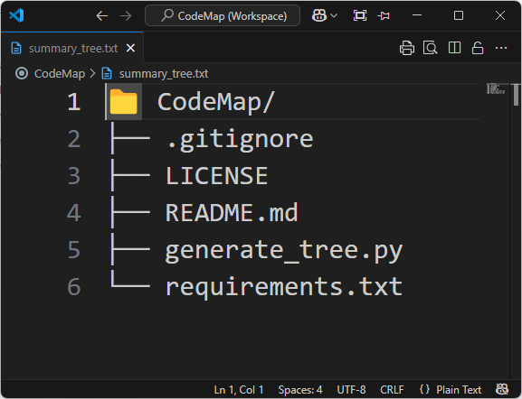

# CodeMap

CodeMap is a lightweight utility to generate a visual directory structure of your codebase. It traverses the filesystem and outputs a clean, readable tree summary, omitting unwanted files and folders.

## Features

* Recursively lists directory contents in a tree format
* Skips unnecessary directories like `.git`, `__pycache__`, `venv`, and common IDE folders
* Ignores system files and binary extensions
* Outputs to a `summary_tree.txt` file in the root directory

## Installation

```bash
pip install -r requirements.txt
```

## Usage

```bash
python generate_tree.py
```

This will generate a `summary_tree.txt` file containing the tree structure of the current working directory.

## Example Output

```
📁 your_project/
├── 📁 src/
│   ├── main.py
│   └── utils.py
├── README.md
└── requirements.txt
```

## Screenshot


*Update the image path or file as needed to match your project's visuals.*

## Contributing

Contributions are welcome! Please open an issue or submit a pull request for improvements or feature suggestions.

## License

This project is licensed under the [Apache License 2.0](./LICENSE).
